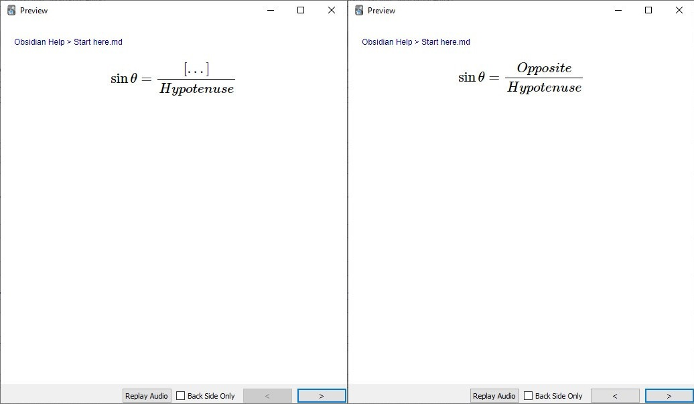

# Obsidian Anki Sync - Yet another anki plugin

This plugin allow you to make flashcards in [Obsidian](https://obsidian.md/) and sync them to [Anki](https://apps.ankiweb.net/).

This is similar to [Obsidian_to_Anki](https://github.com/Pseudonium/Obsidian_to_Anki) except this plugin uses a different and more powerful markup based syntax for making flashcards.

## Installation

1. Download the plugin from Obsidian's Comunity Plugin section which can be accessed from the Settings pane under Third Party Plugins.

2. Download Anki if not installed.

3. Install AnkiConnect on Anki.

   - Open Anki.

   - Select `Tools` > `Add-ons `. Now a Anki addon's dialog will open. 

   - Now click `Get Add-ons...` in addon's dialog and enter [2055492159](https://ankiweb.net/shared/info/2055492159) into the text box labeled `Code` and press the `OK` button to proceed.

   - Select `Tools` > `Add-ons ` to re-open addon's dialog. Select Anki-Connect plugin and click `Config`. Now enter the configuration bellow and click ok.

     ```json
     {
         "apiKey": null,
         "apiLogPath": null,
         "webBindAddress": "127.0.0.1",
         "webBindPort": 8765,
         "webCorsOrigin": "http://localhost",
         "webCorsOriginList": [
             "http://localhost",
             "app://obsidian.md"
         ]
     }
     ```

     

   - Restart Anki.

4. Now, you can use the plugin by clicking Sync to Anki button. 
   NB: Make sure the anki is running before clicking the Sync to Anki button in obsidian.

## Examples

```markdown
<!-- replaceblock-start -->
<!-- replace id="1" text="Opposite" -->
$$\sin \theta = \frac{Opposite}{Hypotenuse}$$
<!-- replaceblock-end -->
```


See [Tutorial](https://github.com/debanjandhar12/Obsidian-Anki-Sync/blob/main/docs/Tutorial.md) for more examples and explanation on usage.

## Features

- **Rendering of Markdown Math, Code Blocks, Images, Tables etc...**
- Cloze **within Latex Math and Code Blocks** by using [replaceblock](https://github.com/debanjandhar12/Obsidian-Anki-Sync/blob/main/docs/replaceblock.md).
- **Breadcrumbs** in Anki that links to file that generated the flashcard.
- **Adding cards to user-specified deck** on a *per-file* or *per-block* basis.
- **Can handle creating, updating, deleting** of Anki cards perfectly.
- **Auto Backup Anki Decks** before every sync.
- Many other features like **extra field, tags etc...**

## Documentation

See [Tutorial](https://github.com/debanjandhar12/Obsidian-Anki-Sync/blob/main/docs/Tutorial.md) for basics.

For detailed documentation on blocks see: 

[basicblock](https://github.com/debanjandhar12/Obsidian-Anki-Sync/blob/main/docs/basicblock.md) [replaceblock](https://github.com/debanjandhar12/Obsidian-Anki-Sync/blob/main/docs/replaceblock.md) [clozeblock](https://github.com/debanjandhar12/Obsidian-Anki-Sync/blob/main/docs/clozeblock.md)

## FAQ
<details>
 <summary>Why yet another plugin for obsidian to anki sync?</summary>
The existing two plugins have a major limitation to implement my workflow: No clozes inside math and code blocks ☹ <br>
This is why I made this.
</details>

<details>
 <summary>How does auto deletation work?</summary>
   First, each anki card is marked as "created by plugin from this vault" and "not created by plugin from this vault". A card is marked as "created by plugin" if it contains the name of vault as tag, as well as ObsidianAnkiSync tag, as well as the type of note of the card must be of type ObsidianAnkiSyncModel.
   Now, if a card is marked "created by plugin from this vault" but it is not available in the vault, then the card is deleted.
</details>

<details>
 <summary>Can i delete or modify the auto-generated oid attribute?
 </summary>
<b>No!</b> Please dont do that. <br> The plugin uses the oid to track the cards in anki.
Deleting it will cause the plugin to delete the old card and create a new one in Anki. This means that the scheduling information for the card gets deleted if you remove or modify oid.
</details>

<details>
 <summary>Where is the auto anki backup taken before every sync stored?</summary>
In Windows 10, it is stored at:<br>
C:\Users\{WindowsUserName}\AppData\Roaming\Anki2\{AnkiProfileName}
<br><br>
NB: It is stored in a per-deck basis with name ObsidianAnkiSync-Backup-${timestamp}_${deck}.apkg
</details>

<details>
 <summary>Do the auto anki backup also store scheduling information?</summary>
 Yes.
</details>
<details>
 <summary>I found a bug. What to do?</summary>
 Please create a issue <a href="https://github.com/debanjandhar12/Obsidian-Anki-Sync/issues">here</a>
</details>
